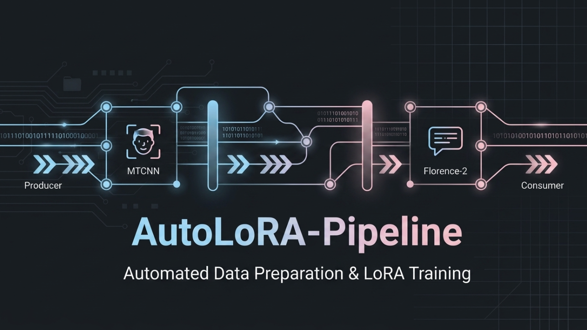
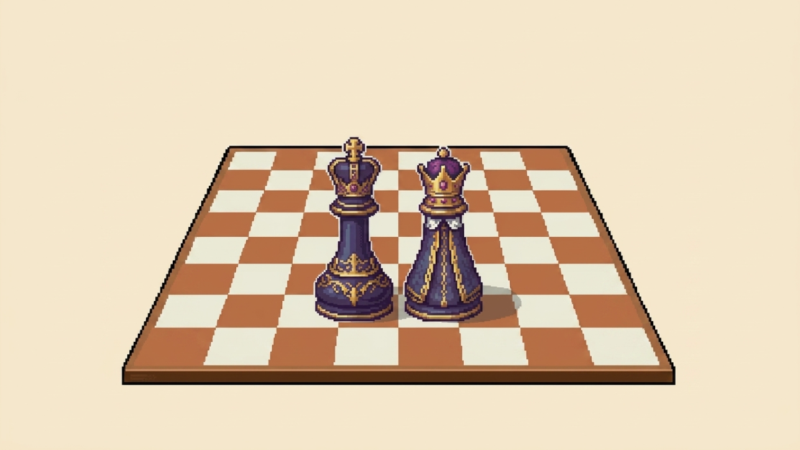

<h1 align="center">Hi, I'm Daniel!  (•◡•) /</h1>

  

  Building across microservices, distributed data systems, and generative AI pipelines.

  
  

 

## 🤔 About Me

Hi! I'm a final-semester Computer Science student at **Tecnológico de Costa Rica (TEC)**, where I also help out as a Teaching Assistant for core programming courses. 

I'm all about backend development, distributed systems, and generative AI. I enjoy the challenge of figuring out how complex systems work under the hood and turning ideas into well-architected software.

-  **Backend & Architecture:** I love building robust services, applying clean code practices, and working with polyglot databases.
-  **AI Enthusiast:** I spend a lot of time experimenting with open-source generative models (like Flux, Wan, and Stable Diffusion), optimizing ComfyUI environments, and managing cloud GPU infrastructure.
-  **What's Next:** I'm currently looking for a graduation internship where I can tackle real-world engineering challenges and continue growing as a developer.

 

## 🚀 Selected Work

A selection of projects I've built, from AI pipelines to distributed systems.

<table>
  <tr>
    <td width="50%" valign="top" style="padding: 12px;">
      
        
      <strong>AutoLoRA-Pipeline</strong>
      &nbsp;
        
      

        Automated pipeline for dataset ingestion, image scraping, and auto-captioning
        for LoRA training. Uses MTCNN and Florence-2 for face detection/captioning on top
        of a producer-consumer architecture for scalable dataset curation.
      

      

        
        
        
        
      

      
    </td>
    <td width="50%" valign="top" style="padding: 12px;">
      
        
      <strong>Biskoto E-commerce</strong>
      &nbsp;
        
      

        Complete e-commerce web app for a bakery. Features a shopping cart,
        secure checkout flow, and an admin panel with role-based access control,
        all backed by Supabase's real-time database.
      

      

        
        
        
      

      
    </td>
  </tr>
  <tr>
    <td width="50%" valign="top" style="padding: 12px;">
      
        
      <strong>Java Chess Game</strong>
      &nbsp;
        
      

        Full-featured desktop chess game with MVC architecture and design patterns
        (Singleton/Factory). Supports all special chess rules, match saving, and
        dynamic bilingual (EN/ES) UI.
      

      

        
        
        
      

      
    </td>
    <td width="50%" valign="top" style="padding: 12px;">
      
        
      <strong>Distributed E-commerce Platform</strong>
      &nbsp;
        
      

        Microservices platform with polyglot persistence (MongoDB, PostgreSQL, Neo4j,
        Redis, Elasticsearch) and a Spark/Hive ETL pipeline orchestrated with Airflow
        for OLAP analytics.
      

      

        
        
        
        
        
      

      
    </td>
  </tr>
</table>

## 💻 Tech Stack

<table>
  <tr>
    <td align="center" valign="top" width="25%" style="padding: 16px;">
        
       
      
    </td>
    <td align="center" valign="top" width="25%" style="padding: 16px;">
        
       
      
    </td>
    <td align="center" valign="top" width="25%" style="padding: 16px;">
        
      
    </td>
    <td align="center" valign="top" width="25%" style="padding: 16px;">
        
       
      
    </td>
  </tr>
</table>

 

## 👾 GitHub Contributions

  <picture>
    <source media="(prefers-color-scheme: dark)" srcset="https://raw.githubusercontent.com/DanielAR27/DanielAR27/output/github-contribution-grid-snake-dark.svg">
    <source media="(prefers-color-scheme: light)" srcset="https://raw.githubusercontent.com/DanielAR27/DanielAR27/output/github-contribution-grid-snake.svg">
    
  </picture>

 
 

---

  
  
  

    <i>I'm always open to discussing software, architecture, or potential opportunities.</i>
  

  
   

  

